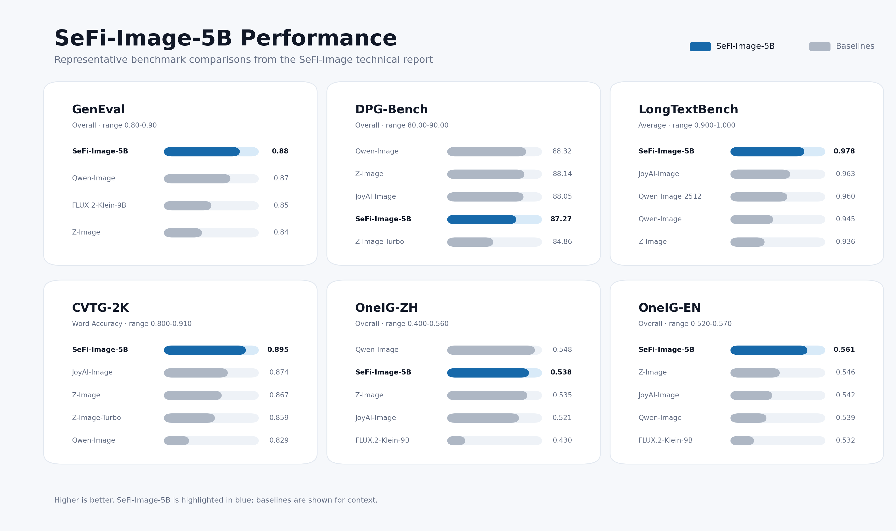

<div align="center">

# SeFi-Image

Official inference repository for SeFi-Image text-to-image generation.

<p>
  <a href="https://jmliu206.github.io/sefi-web/"></a>
  &nbsp;
  <a href="https://arxiv.org/pdf/2606.22568"></a>
  &nbsp;
  <a href="https://huggingface.co/SeFi-Image"></a>
  &nbsp;
  <a href="#model-zoo"></a>
  &nbsp;
  <a href="#quick-start"></a>
</p>

<table>
  <tr>
    <td width="50%"></td>
    <td width="50%"></td>
  </tr>
</table>

</div>

---

**SeFi-Image** is a text-to-image model family built with
**Semantic-First Diffusion**. It separates semantic and texture latent streams
and denoises semantic structure slightly ahead of texture details, giving the
texture stream a cleaner structural anchor during generation.

This repository provides command-line and Python inference for SeFi-Image Base,
RL, and Turbo checkpoints. Use `inference.py` for generation scripts or the
`sefi` package for integration in Python projects.

## Highlights

<table>
  <tr>
    <td width="33%" align="center">
      <br>
      <b>Semantic-first generation</b><br>
      <sub>Semantic latents provide a cleaner structural anchor for image synthesis.</sub>
    </td>
    <td width="33%" align="center">
      <br>
      <b>Faster training</b><br>
      <sub>The 5B model reaches strong benchmark performance with about <b>125K A800 GPU hours</b>.</sub>
    </td>
    <td width="33%" align="center">
      <br>
      <b>Generation-reconstruction trade-off</b><br>
      <sub>A high-fidelity texture latent preserves reconstruction detail while a compact semantic latent simplifies generation.</sub>
    </td>
  </tr>
</table>

## Model Zoo

The checkpoint column is clickable and can be passed directly to
`--checkpoint` or `SEFIInferencePipeline.from_pretrained(...)`. The checkpoint
name and `sefi_config.yaml` are used to infer model family, scale, default
sampling steps, and guidance scale.

| Family | Model | Checkpoint | Steps | Guidance |
| :--- | :--- | :--- | :---: | :---: |
| Base | SeFi-Image-1B-Base | [SeFi-Image/SeFi-Image-1B-Base](https://huggingface.co/SeFi-Image/SeFi-Image-1B-Base) | 50 | 4.0 |
| Base | SeFi-Image-2B-Base | [SeFi-Image/SeFi-Image-2B-Base](https://huggingface.co/SeFi-Image/SeFi-Image-2B-Base) | 50 | 4.0 |
| Base | SeFi-Image-5B-Base | [SeFi-Image/SeFi-Image-5B-Base](https://huggingface.co/SeFi-Image/SeFi-Image-5B-Base) | 50 | 4.0 |
| RL | SeFi-Image-5B-RL | [SeFi-Image/SeFi-Image-5B-RL](https://huggingface.co/SeFi-Image/SeFi-Image-5B-RL) | 50 | 4.0 |
| Turbo | SeFi-Image-1B-turbo | [SeFi-Image/SeFi-Image-1B-turbo](https://huggingface.co/SeFi-Image/SeFi-Image-1B-turbo) | 4 | 1.0 |
| Turbo | SeFi-Image-2B-turbo | [SeFi-Image/SeFi-Image-2B-turbo](https://huggingface.co/SeFi-Image/SeFi-Image-2B-turbo) | 4 | 1.0 |
| Turbo | SeFi-Image-5B-turbo | [SeFi-Image/SeFi-Image-5B-turbo](https://huggingface.co/SeFi-Image/SeFi-Image-5B-turbo) | 4 | 1.0 |

## Quick Start

Run from the repository root so Python can import `sefi`.

```bash
python inference.py \
  --checkpoint SeFi-Image/SeFi-Image-5B-Base \
  --prompt "A red apple on a wooden table." \
  --output-dir outputs/inference/sefi_5b_base \
  --seed 42
```

Turbo checkpoints use the same interface with fewer denoising steps:

```bash
python inference.py \
  --checkpoint SeFi-Image/SeFi-Image-5B-turbo \
  --prompt "A blue ceramic mug on a white desk." \
  --steps 4 \
  --guidance-scale 1.0 \
  --output-dir outputs/inference/sefi_5b_turbo \
  --seed 42
```

If a checkpoint requires authentication, log in once before running inference:

```bash
huggingface-cli login
```

## Python API

```python
from sefi import SEFIInferencePipeline

pipe = SEFIInferencePipeline.from_pretrained(
    "SeFi-Image/SeFi-Image-5B-Base",
)

images = pipe(
    "A red apple on a wooden table.",
    seed=42,
)
images[0].save("sefi_5b_base.png")
```

Turbo checkpoints use the same API:

```python
from sefi import SEFIInferencePipeline

pipe = SEFIInferencePipeline.from_pretrained(
    "SeFi-Image/SeFi-Image-5B-turbo",
)

images = pipe(
    "A blue ceramic mug on a white desk.",
    num_inference_steps=4,
    guidance_scale=1.0,
    seed=123,
)
images[0].save("sample.png")
```

For Base and RL checkpoints, omit `num_inference_steps` and `guidance_scale` to
use the checkpoint defaults.

## Reference Demos

User-facing examples live under [`demo/`](demo/README.md):

- [`demo/semvae/`](demo/semvae/README.md) extracts DINOv2 patch features,
  compresses them into SemVAE semantic latents, and validates reconstruction
  with cosine similarity. Its tiny public fixture is hosted in
  [SeFi-Image-SemVAE-Demo](https://huggingface.co/datasets/SeFi-Image/SeFi-Image-SemVAE-Demo).

## Installation

Create an environment and install the runtime dependencies. The PyTorch command
below uses CUDA 12.6 wheels; choose the wheel index that matches your machine.

```bash
conda create -n sefi-infer python=3.11 -y
conda activate sefi-infer

pip install torch torchvision --index-url https://download.pytorch.org/whl/cu126
pip install diffusers transformers accelerate safetensors huggingface_hub omegaconf pillow
```

## Batch and Multi-GPU

Generate from a text file with one prompt per line: 

```bash
python inference.py \
  --checkpoint SeFi-Image/SeFi-Image-5B-Base \
  --prompt-file prompts.txt \
  --batch-size 2 \
  --num-images-per-prompt 1 \
  --output-dir outputs/inference/batch
```

Multi-GPU inference uses `accelerate` and shards prompts across processes:

```bash
accelerate launch --num_processes 8 inference.py \
  --checkpoint SeFi-Image/SeFi-Image-5B-Base \
  --prompt-file prompts.txt \
  --batch-size 1 \
  --output-dir outputs/inference/sefi_5b_multigpu
```

Images are saved as PNG files. Each rank writes `metadata_rank*.jsonl`; rank 0
also writes `inference_manifest.json`.

## Evaluation Snapshot

The figure below summarizes representative SeFi-Image-5B benchmark comparisons
from the technical report.

<p align="center">
  
</p>

## CLI Options

| Flag | Description | Default |
| :--- | :--- | :--- |
| `--checkpoint` | Hugging Face repo id or local checkpoint path | required |
| `--config` | Optional config path; otherwise loaded from the checkpoint root | `sefi_config.yaml` |
| `--prompt` | Single prompt | empty |
| `--prompt-file` | UTF-8 text file with one prompt per line | empty |
| `--output-dir` | Output directory | `outputs/inference` |
| `--cache-dir` | Hugging Face snapshot cache for downloaded checkpoints | `outputs/model_weights/sefi_inference` |
| `--steps` | Number of denoising steps | model default |
| `--guidance-scale` | Guidance scale | model default |
| `--height`, `--width` | Output size | `1024`, `1024` |
| `--batch-size` | Prompts processed per local forward loop | `1` |
| `--num-images-per-prompt` | Repeats per prompt | `1` |
| `--seed` | Base random seed | `20260616` |
| `--device` | Explicit device override | distributed device or CUDA |
| `--dtype` | Inference dtype: `bf16` or `fp32` | model default |

Turbo checkpoints currently support `4`, `8`, or `10` denoising steps and should
run with `--guidance-scale 1.0`.

## Checkpoint Layout

Each checkpoint artifact should be self-contained and include `sefi_config.yaml`
at the artifact root. Relative paths inside the config are resolved from that
root.

```text
sefi-model/
├── sefi_config.yaml
├── transformer/
│   ├── config.json
│   ├── diffusion_pytorch_model-00001-of-000xx.safetensors
│   └── diffusion_pytorch_model.safetensors.index.json
├── scheduler/
│   └── scheduler_config.json
├── vae/
│   └── ...
└── text_encoder/
    └── ...
```

The config tells the inference code where to find the final inference VAE,
scheduler files, text encoder weights, and DiT transformer weights. Local paths
and Hugging Face snapshots use the same layout.

## Responsible AI

SeFi-Image is released for research use and is not intended for direct product
or service deployment. Responsible AI considerations were incorporated during
development, including data selection, model training, and evaluation. The
training data combines public, licensed, and internally curated sources, with
processing intended to remove clearly identifiable personal information and
reduce harmful content where possible.

Because web-scale image-text data can contain biases, uneven representation,
and imperfect metadata, the model may produce outputs that are inaccurate,
biased, inappropriate, misleading, or raise copyright and IP-related concerns
under certain prompts. Use the model in controlled research settings with
appropriate human oversight. Downstream users are responsible for applying
additional safeguards, including content moderation, validation, and compliance
checks, before broader use.

## Citation
 
If you use SeFi-Image in your work, please cite the project report:

```
@misc{sefiteam2026sefiimagetexttoimagefoundationmodel,
      title={SeFi-Image: A Text-to-Image Foundation Model with Semantic-First Diffusion}, 
      author={SeFi-Team},
      year={2026},
      eprint={2606.22568},
      archivePrefix={arXiv},
      primaryClass={cs.CV},
      url={https://arxiv.org/abs/2606.22568}, 
}
```

## License

This project is released under the MIT License.
